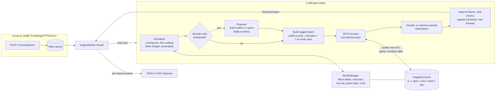
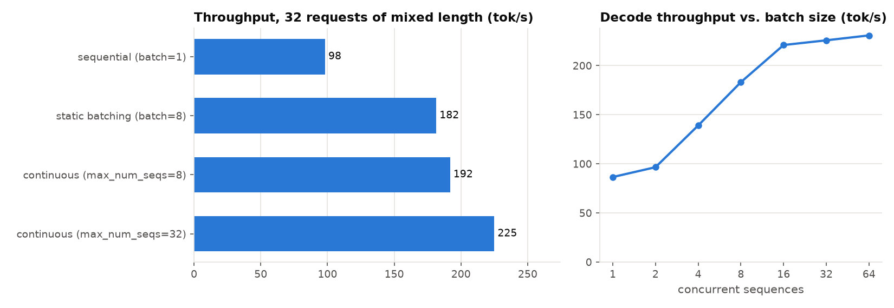
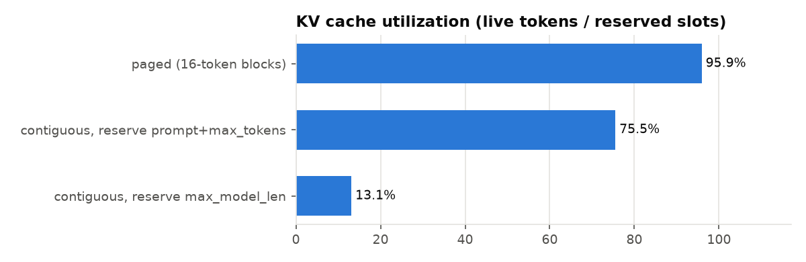
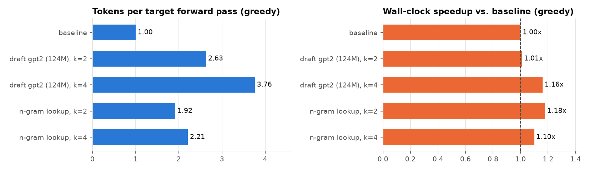

# nanoserve

A from-scratch LLM inference engine in Python and NumPy that implements the core ideas behind vLLM: a **paged KV cache**, **continuous batching**, and **speculative decoding** with exact rejection sampling. It serves real GPT-2 weights on CPU.

nanoserve is a teaching and portfolio project. It is small enough to read in an afternoon (about 2,300 lines of source, including docstrings), and the tests check correctness against reference implementations. It is not a production server. See [Limitations](#limitations).

```
$ nanoserve generate --model gpt2 --prompt "The capital of France is" --temperature 0 --max-tokens 20
The capital of France is the capital of the French Republic, and the capital of the French Republic is the capital of the French
```

## Contents

- [Quick start](#quick-start)
- [Architecture](#architecture)
- [How each technique is implemented](#how-each-technique-is-implemented)
  - [GPT-2 in NumPy](#gpt-2-in-numpy)
  - [Paged KV cache](#paged-kv-cache)
  - [Prefix caching and copy-on-write](#prefix-caching-and-copy-on-write)
  - [Continuous batching scheduler](#continuous-batching-scheduler)
  - [Speculative decoding](#speculative-decoding)
  - [Sampling](#sampling)
  - [HTTP server](#http-server)
- [Measured results](#measured-results)
- [Testing](#testing)
- [Limitations](#limitations)
- [Project layout](#project-layout)
- [References](#references)

## Quick start

```bash
python -m venv .venv && source .venv/bin/activate
pip install -e ".[dev]"            # numpy + regex at runtime; pytest/ruff/mypy for dev

nanoserve download gpt2            # ~550 MB into ./weights (gitignored; override with NANOSERVE_CACHE)
nanoserve generate --prompt "Paged attention is" --max-tokens 40 --seed 0

# speculative decoding: gpt2-medium target, gpt2 draft
nanoserve download gpt2-medium
nanoserve generate --model gpt2-medium --draft-model gpt2 -k 4 --temperature 0 \
    --prompt "In machine learning, a transformer is"

# OpenAI-compatible server
nanoserve serve --model gpt2 --port 8000
curl -N localhost:8000/v1/completions -H 'Content-Type: application/json' \
  -d '{"prompt": "Hello, my name is", "max_tokens": 32, "stream": true, "seed": 1}'
```

Requests and responses follow the shape of the OpenAI `/v1/completions` API.

## Architecture



One call to `LLMEngine.step()` is one iteration of continuous batching. The scheduler decides which sequences run and how many tokens each feeds. The engine builds one ragged batch and runs one forward pass, then samples (or verifies draft tokens) and updates state. Requests can join or leave between any two steps.

## How each technique is implemented

### GPT-2 in NumPy

[`model.py`](src/nanoserve/model.py) implements token and position embeddings, pre-LayerNorm blocks, causal multi-head attention, the tanh-GELU MLP and the tied LM head. Weights come from Hugging Face `model.safetensors`. [`weights.py`](src/nanoserve/weights.py) downloads them over plain HTTPS and parses the safetensors container itself (an 8-byte header length, a JSON header, then raw bytes), so `torch` is not a runtime dependency. The byte-level BPE tokenizer in [`tokenizer.py`](src/nanoserve/tokenizer.py) is also written from scratch from `vocab.json` and `merges.txt`. It includes the GPT-2 pre-tokenization regex, the reversible byte-to-unicode table, and rank-ordered merges.

The model has two forward paths that share the layer code:

- `forward_dense(tokens)` is the textbook reference: one sequence, full causal attention, no cache. Tests use it as ground truth.
- `forward(inputs, cache)` is the serving path. It takes a ragged batch where each sequence contributes any number of new tokens: a prefill chunk, one decode token, or `1 + k` tokens to verify. All dense layers (QKV, projections, MLP) run as one matmul over the concatenated tokens of the whole batch. The weights are read once per step, not once per sequence, which is where batching gets its throughput. The LM head (768 x 50257) runs only on the rows whose logits are needed.

Correctness: GPT-2 small logits match Hugging Face `transformers` with a max abs difference of about 4e-4 in float32, and the argmax matches at every position (`tests/test_gpt2_reference.py`). The paged path matches the dense path within 1e-9 in float64 on the tiny test model.

### Paged KV cache

[`kv_cache.py`](src/nanoserve/kv_cache.py) and [`block_manager.py`](src/nanoserve/block_manager.py) work the way an OS pages virtual memory:

- **Physical storage** is two arrays `k, v` of shape `(n_layer, num_blocks * block_size, n_head, head_dim)`. A *slot* is one token position inside one block.
- **Block tables.** Each sequence owns a list of block ids. Logical position `p` lives in slot `table[p // B] * B + p % B`. A sequence's blocks can be anywhere in memory.
- **Allocator.** A free list with per-block reference counts. `reserve(seq, start, end)` is atomic: it either grows the table and performs any needed copy-on-write, or it changes nothing and returns `False`. The scheduler relies on this to decide admission and preemption.
- **Attention over the block table.** Each layer scatters new K/V into the slots of the new tokens (`cache.k[layer, write_slots] = k`), then gathers each sequence's context through its slot list. Decode rows (one query each) are attended in one padded, masked, vectorized call. Multi-token rows (prefill chunks, speculative verification) are attended per sequence with an offset causal mask: query `i` at absolute position `start + i` sees keys `<= start + i`.

A sequence wastes at most `block_size - 1` slots, in its last block. Nothing is reserved for tokens that have not been generated yet. The [results](#kv-cache-memory) quantify the effect.

### Prefix caching and copy-on-write

- **Automatic prefix caching.** When every position of a block has been computed, the block is registered under `hash(parent_hash, block_tokens)`, chained so a hash identifies the entire prefix. A new sequence walks its prompt block by block and reuses matching blocks instead of recomputing them. Freed blocks keep their hash and sit in the free list in LRU order. They are evicted from the hash table only when the allocator recycles them, so a preempted or finished request's prefix often stays reusable. The last prompt token is always recomputed because we need its logits.
- **Fork plus copy-on-write.** Parallel sampling (`n > 1`) prefills the prompt once and then forks `n - 1` children whose block tables share every block (refcount `n`). Any write to a block with refcount > 1 first copies it. Here that means the partly filled last prompt block, the first time each child appends a token. The copy is applied to every attached cache, both target and draft.

### Continuous batching scheduler

[`scheduler.py`](src/nanoserve/scheduler.py) implements iteration-level scheduling (Orca) with vLLM-style memory management. Every step it builds a fresh batch:

1. **Running sequences first, oldest first.** A caught-up sequence costs 1 decode token, plus `k` lookahead slots when speculating. A sequence that is still prefilling gets its next prompt chunk. If its next slots cannot be allocated, the **youngest** running sequence is preempted, possibly the requester itself, until the allocation fits.
2. **Waiting sequences next, FCFS.** They are admitted while the per-step token budget (`max_num_batched_tokens`), the `max_num_seqs` cap and free blocks allow. Prompts longer than the remaining budget are **chunked**, so a long prompt never stalls in-flight decodes. Prefix-cache hits skip computed blocks. No new sequences are admitted in a step that had to preempt, which prevents thrashing.

Preemption is by **recomputation**. The victim's blocks are freed, it keeps its generated tokens, and it re-enters the waiting queue in arrival order. When it is re-admitted it prefills `prompt + output` in one pass, which is cheap if its blocks are still in the prefix cache. Ordering by arrival everywhere makes the policy starvation-free: a request can only be preempted in favor of an older one. A sequence that cannot fit even when it is the only one running is finished with `finish_reason="length"` instead of livelocking.

Each sequence has its own seeded `numpy.random.Generator`, so a seeded request produces the same tokens whatever else is in the batch, including in runs where preemption occurs (tested).

### Speculative decoding

[`speculative.py`](src/nanoserve/speculative.py). For a caught-up sequence of length `L`:

1. A **proposer** drafts up to `k` tokens `x1..xk` with distributions `q1..qk`. Two proposers are implemented:
   - a **draft model**: any smaller GPT-2 that shares the vocabulary (for example `gpt2` for `gpt2-medium`), or the target's own first N layers (`--draft-layers`). It runs `k` batched forwards. It keeps its own paged KV cache that **shares block ids** with the target's, so allocation, copy-on-write and preemption apply to both automatically. `Sequence.draft_num_computed` tracks how much of the draft cache is valid; stale entries are overwritten on the next step.
   - **n-gram / prompt lookup**: if the last `n` tokens occurred earlier in the sequence, propose what followed them. It costs no model compute, and its `q` is one-hot.
2. The target runs **once** on `[t_{L-1}, x1, ..., xk]` and returns `p1..p_{k+1}`. The scheduler reserved these `k` lookahead slots in advance.
3. **Modified rejection sampling** (Leviathan et al. 2023; Chen et al. 2023): accept `xi` with probability `min(1, pi(xi) / qi(xi))`. At the first rejection, sample a replacement from `norm(max(0, pi - qi))` and stop. If all `k` are accepted, sample a bonus token from `p_{k+1}`. Each step emits between 1 and `k + 1` tokens.

The emitted tokens are distributed **exactly** as the target's, after temperature, top-k and top-p, whatever the draft proposes. With greedy decoding, `p` and `q` are one-hot, so the same rule reduces to "accept while the draft equals the target argmax", and the output is token-for-token identical to plain greedy.

Bookkeeping after verification: target K/V is valid through the accepted tokens, so `num_computed += 1 + accepted`. Draft K/V is valid through `L + min(accepted, k - 1)`. K/V written for rejected positions is never read, because attention only covers computed positions, and it is overwritten later.

### Sampling

[`sampling.py`](src/nanoserve/sampling.py) supports temperature (`0` means greedy), top-k, top-p (nucleus: the smallest set whose mass reaches `p`, always at least one token), a per-request seed, stop token ids, `max_tokens`, `ignore_eos` and `n`. `probs_from_logits` returns the exact distribution that gets sampled. Speculative decoding uses the same function on both models, which is what makes the acceptance rule exact under every sampling setting.

### HTTP server

[`server.py`](src/nanoserve/server.py) uses only the standard library. A single `EngineWorker` thread owns the engine and calls `step()` in a loop. HTTP handler threads only enqueue requests and read their own output queue, so concurrent clients are batched together by the scheduler. Endpoints: `POST /v1/completions` (string or token-id `prompt`, `max_tokens`, `temperature`, `top_p`, `top_k`, `n`, `seed`, `stop`, `stream`), `GET /v1/models`, and `GET /health`. Streaming uses server-sent events and ends with `data: [DONE]`. An incremental UTF-8 detokenizer never splits a multi-byte character across chunks. Stop strings hold back a short tail while streaming. A client disconnect aborts the request and frees its KV blocks.

## Measured results

All numbers below were measured by [`benchmarks/bench.py`](benchmarks/bench.py) on an **Apple Silicon Mac (M5, 10 cores, 16 GB) running on the CPU only**, with NumPy 2.5 (Accelerate BLAS), float32, Python 3.14, and real GPT-2 weights. Raw output is in [`docs/results.json`](docs/results.json). The absolute numbers are CPU numbers and are meant for comparing configurations with each other.

### Continuous batching throughput

GPT-2 small (124M). The workload is 32 requests with prompts of 16–160 tokens and outputs of 16–128 tokens (2,257 output tokens in total, greedy), all submitted at once.

| Mode | Output tok/s | vs. sequential |
|---|---:|---:|
| Sequential, one request at a time | 98.2 | 1.00x |
| Static batching, batches of 8 run to completion | 181.5 | 1.85x |
| Continuous batching, `max_num_seqs=8` | 191.9 | 1.95x |
| Continuous batching, `max_num_seqs=32` | 225.0 | 2.29x |



Batching raises throughput because every dense layer becomes one matrix-matrix product over all sequences in the step, so each weight is loaded once per step instead of once per sequence. At the same batch size, continuous batching beats static batching because a finished sequence's slot is refilled on the next step. Static batches wait for their longest member. The right-hand chart shows decode throughput rising from 86.6 tok/s at batch 1 to 221 tok/s at 16 concurrent sequences, then flattening (230.8 at 64). Past that point the CPU is compute-bound, and per-sequence attention and Python overhead grow with the batch.

### KV cache memory

The same kind of workload (64 requests) was replayed step by step. At each step we compared the KV slots reserved for the running sequences with the tokens actually stored.

| Strategy | Utilization (live tokens / reserved slots) |
|---|---:|
| **Paged**, 16-token blocks (this engine) | **95.9%** |
| Contiguous, reserve `prompt + max_tokens` per request | 75.5% |
| Contiguous, reserve `max_model_len` (1,024) per request | 13.1% |



Under a fixed budget of 4,096 token slots (288 MB of fp32 KV for GPT-2 small), the paged engine ran up to **40 of these requests concurrently**. It relied on preemption when growth outran memory: 27 recompute preemptions over the run. Contiguous reservation fits 25 (reserving `prompt + max_tokens`) or 4 (reserving `max_model_len`). The "reserve `prompt + max_tokens`" baseline is generous, because it assumes `max_tokens` is known and tight. In this benchmark it is exact, since EOS is ignored.

### Prefix caching

Sixteen requests share a 225-token prefix, each followed by 8 unique tokens, with 16 output tokens each and at most 4 running at a time.

| | Prefill tokens computed | Wall time |
|---|---:|---:|
| Prefix caching off | 3,728 | 7.44 s |
| Prefix caching on | 1,040 | 2.99 s |

The first wave of 4 requests computes the prefix (they are admitted in the same step, so none of them can reuse another's blocks yet). Each of the other 12 requests reuses 14 cached blocks (224 tokens) and prefills only 9 tokens: the last prefix token, which falls in a partly filled block, plus its 8 unique tokens. That is 4 × 233 + 12 × 9 = 1,040.

### Speculative decoding

Target: GPT-2 medium (355M). Draft: GPT-2 small (124M, same tokenizer), or n-gram prompt lookup. Batch size 1, 4 prompts, 96 output tokens each.

| Method (greedy) | Acceptance rate | Tokens per target forward | Wall-clock speedup | Output identical to baseline |
|---|---:|---:|---:|:---:|
| Baseline (37.6 tok/s) | – | 1.00 | 1.00x | – |
| Draft gpt2, k=2 | 84.7% | 2.63 | 1.01x | yes |
| Draft gpt2, k=4 | 74.4% | 3.76 | 1.16x | yes |
| N-gram lookup, k=2 | 67.4% | 1.92 | 1.18x | yes |
| N-gram lookup, k=4 | 54.1% | 2.21 | 1.10x | yes |

| Method (temperature 0.8) | Acceptance rate | Tokens per target forward | Wall-clock speedup |
|---|---:|---:|---:|
| Baseline (37.1 tok/s) | – | 1.00 | 1.00x |
| Draft gpt2, k=2 | 63.9% | 2.23 | 0.84x |
| Draft gpt2, k=4 | 55.7% | 3.10 | 0.86x |
| N-gram lookup, k=2 | 17.6% | 1.14 | 0.78x |
| N-gram lookup, k=4 | 6.9% | 1.11 | 0.73x |



**The algorithm works as specified.** Greedy speculative output is identical to plain greedy in every configuration, and the target runs 2.6–3.8x fewer forward passes with a model draft. **The wall-clock gain on this hardware is small**, and with sampling it is negative. The benchmark also measures why:

- On this CPU a target forward that verifies 2, 3 or 5 tokens costs **1.86x, 1.94x and 2.13x** a single-token decode forward. Speculative decoding assumes verification costs about the same as one decode step, which is true on a GPU where decode is memory-bandwidth-bound. On Accelerate, a 1-row matmul takes a fast matrix-vector path, and 2 or more rows fall back to a much slower small-matrix path.
- A GPT-2 small draft step costs **0.31x** a GPT-2 medium step, and k=4 needs four of them.

With these costs, a k=4 model-draft step costs about 4 × 0.31 + 2.13 ≈ 3.4 decode-equivalents and emits 3.76 tokens, a gain of about 1.1x, which matches the measurement. N-gram drafting is free but finds few matches when sampling at temperature 0.8. The target-forward reduction is the hardware-independent result. On hardware where verifying k+1 tokens costs about the same as decoding 1, it becomes the speedup.

## Testing

```bash
pytest -q            # fast suite: 82 tests, ~6 s, random tiny models, no downloads
pytest -q -m slow    # needs `nanoserve download gpt2`; compares against Hugging Face
ruff check . && ruff format --check . && mypy
```

| Area | What the tests check |
|---|---|
| Attention (`test_model.py`) | paged == dense for ragged batched prefill, batched decode, uneven chunking, and mixed prefill+decode batches on scattered, shuffled blocks with block sizes 1, 4 and 16 |
| Real weights (`test_gpt2_reference.py`, slow) | GPT-2 logits vs. live `transformers` and a recorded fixture; paged decode vs. dense on real weights |
| Allocator (`test_block_manager.py`) | exhaustion, atomic failure, refcounts, CoW isolation, prefix hits, LRU eviction, and a 2,000-operation randomized run that checks refcounts against block tables after every operation and ends with zero leaked blocks |
| Scheduler/engine (`test_engine.py`) | batched greedy == dense reference; token budget never exceeded; mid-flight admission; preemption preserves outputs; victims are always the youngest and FCFS completion order holds; seeded outputs independent of batch mix; prefix reuse; forks; stop conditions; abort; no leaks after every run |
| Speculative (`test_speculative.py`) | spec greedy == plain greedy token-for-token (truncated, unrelated and n-gram drafts, k = 1, 2, 5, also under preemption and chunked prefill); chi-square tests that the acceptance rule *and the full engine* reproduce the exact target distribution (the 3-token joint distribution compared with enumerated probabilities, with top-k and top-p on); **negative controls** showing that the same tests reject a verifier that accepts every draft token |
| Tokenizer, sampling, server | BPE merge order, round trips including emoji and CJK, exact match with HF's tokenizer (slow); top-k, top-p, temperature, seeds; HTTP shape, SSE == non-streamed text, stop strings, `n`, concurrent requests batched, 400/404 handling |

CI (GitHub Actions) runs ruff, mypy and the fast suite on Python 3.11, 3.12 and 3.13.

## Limitations

This is an educational engine, not a production server.

- **CPU and NumPy only.** No GPU kernels, no fused attention, no quantization, float32 only. The paged gather copies context K/V on every layer. A real PagedAttention kernel reads blocks in place.
- **The hardware does not match the regime these techniques target.** vLLM's design assumes a memory-bandwidth-bound accelerator where adding rows to a matmul is nearly free. On this CPU that holds only partly (see the speculative decoding results). Absolute throughput is low, and the relative numbers would look different on a GPU.
- **GPT-2 family only** (learned absolute positions, 1,024-token context). There is no RoPE, GQA or sliding window.
- **Single process, single engine thread.** No tensor parallelism. Python overhead per step is non-trivial.
- **Preemption by recompute only.** Swapping blocks to host memory is not implemented. On a CPU, "host memory" is the same memory.
- **Draft-model speculation and prefix caching interact conservatively.** The draft re-fills its own cache for prefix-cached blocks, which copy-on-write copies when they are shared. The result is correct but saves less memory.
- **Server.** Text completions only, no chat template, no logprobs, no authentication, and no backpressure beyond the scheduler queue.

## Project layout

```
src/nanoserve/
  config.py         model hyper-parameters (HF config.json compatible)
  model.py          GPT-2 forward: dense reference + ragged-batch paged path
  kv_cache.py       physical K/V storage addressed by slot
  block_manager.py  allocator, block tables, prefix cache, fork, copy-on-write
  sequence.py       per-sequence state
  scheduler.py      continuous batching, chunked prefill, preemption
  engine.py         step loop: schedule -> forward -> sample/verify -> update
  speculative.py    proposers + rejection sampling
  sampling.py       temperature / top-k / top-p
  tokenizer.py      GPT-2 byte-level BPE + incremental detokenizer
  weights.py        HF download + safetensors parser
  server.py         OpenAI-compatible HTTP server (SSE)
  cli.py            nanoserve download | generate | serve
benchmarks/bench.py every number in this README
tests/              pytest suite (fast by default; `-m slow` for real weights)
```

## References

- W. Kwon et al. *Efficient Memory Management for Large Language Model Serving with PagedAttention.* SOSP 2023. [arXiv:2309.06180](https://arxiv.org/abs/2309.06180)
- G.-I. Yu et al. *Orca: A Distributed Serving System for Transformer-Based Generative Models.* OSDI 2022. [usenix.org](https://www.usenix.org/conference/osdi22/presentation/yu)
- Y. Leviathan, M. Kalman, Y. Matias. *Fast Inference from Transformers via Speculative Decoding.* ICML 2023. [arXiv:2211.17192](https://arxiv.org/abs/2211.17192)
- C. Chen et al. *Accelerating Large Language Model Decoding with Speculative Sampling.* 2023. [arXiv:2302.01318](https://arxiv.org/abs/2302.01318)
- A. Saxena. *Prompt Lookup Decoding.* 2023. [github.com/apoorvumang/prompt-lookup-decoding](https://github.com/apoorvumang/prompt-lookup-decoding)
- A. Agrawal et al. *SARATHI: Efficient LLM Inference by Piggybacking Decodes with Chunked Prefills.* 2023. [arXiv:2308.16369](https://arxiv.org/abs/2308.16369)
- A. Radford et al. *Language Models are Unsupervised Multitask Learners* (GPT-2). 2019.
- [vLLM](https://github.com/vllm-project/vllm), [nanoGPT](https://github.com/karpathy/nanoGPT) and [picoGPT](https://github.com/jaymody/picoGPT), which inspired the minimal-NumPy approach.

## License

MIT. See [LICENSE](LICENSE).
